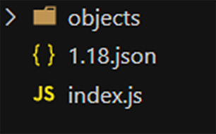

# Minecraft Default Resource Pack Extractor

Your `minecraft` folder contains assets in the `assets/objects` folder, but they are stored by hashes in the `assets/indexes` folder. This tool will use the index file (ex. `1.18.json`) found in `assets/indexes` to generate the real structure. The result is the default resource pack with **every asset**.

## How to use

Look in your .minecraft directory to find the `assets` folder.

1. Make a folder.
2. Add my `index.js` to the folder.
3. Copy the `objects` folder into the folder.
4. Copy the index file (ex. `indexes/1.18.json`) into the folder.
5. Run `node index.js`
6. The result is a folder with every asset.
